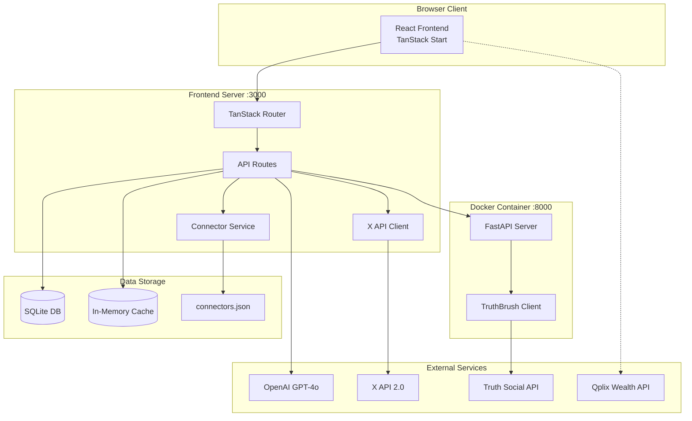
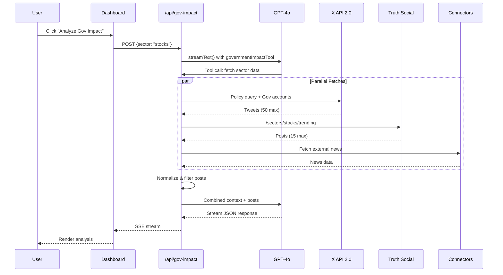
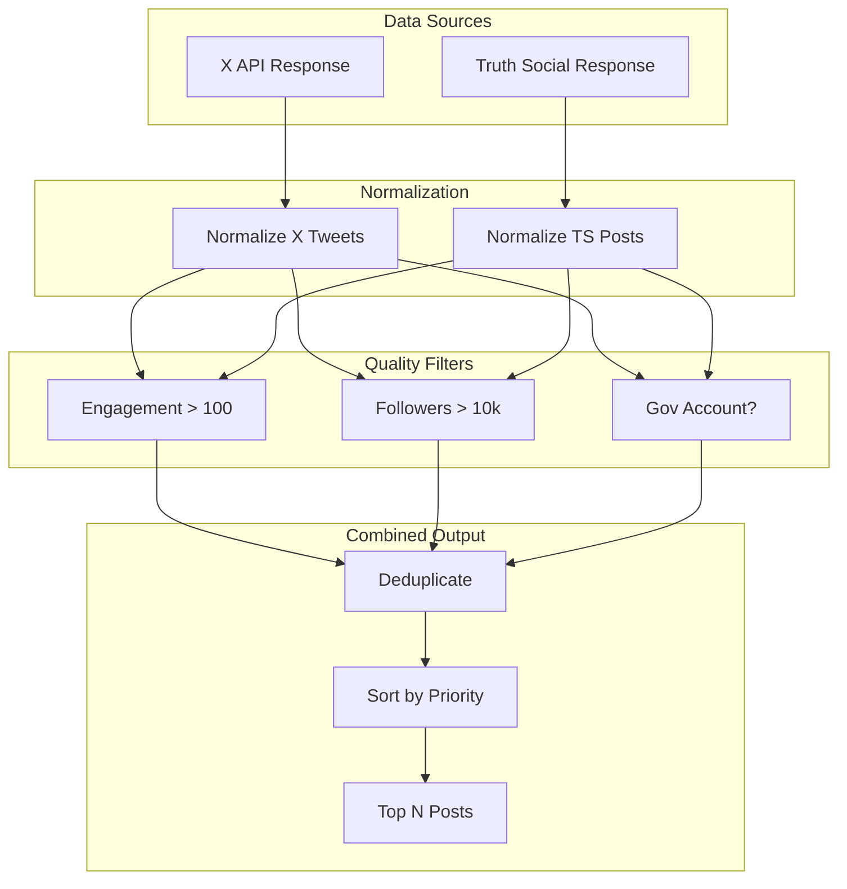
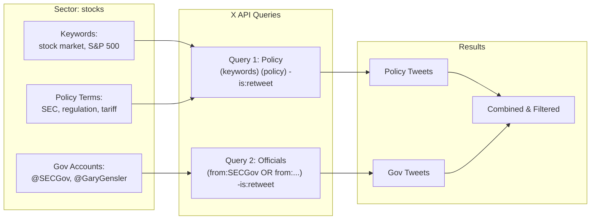
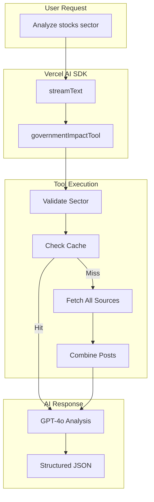
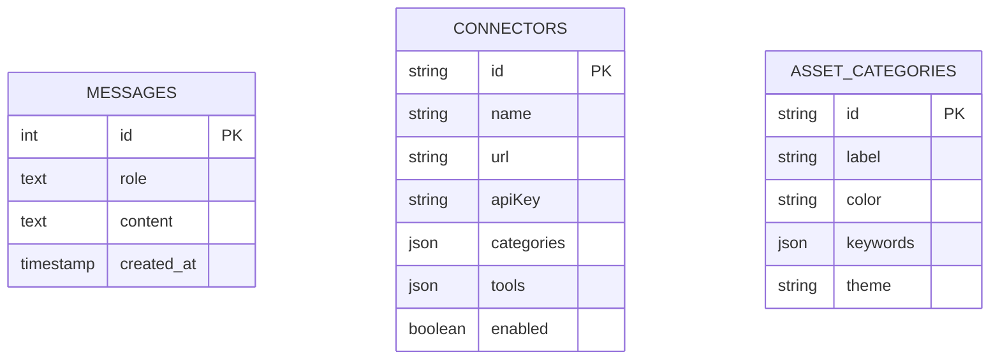
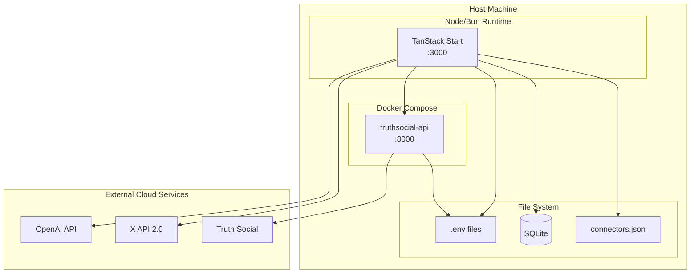
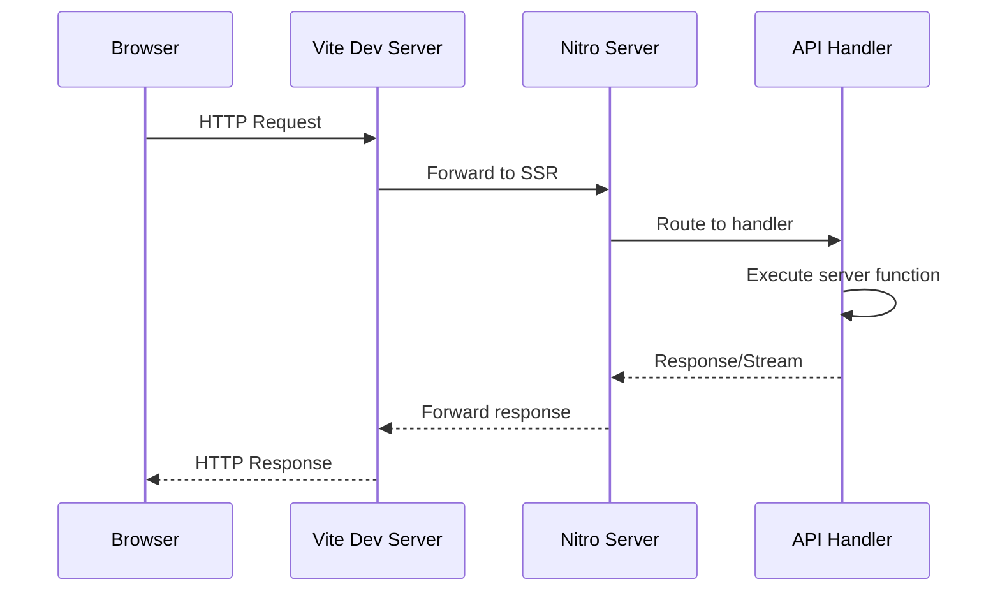
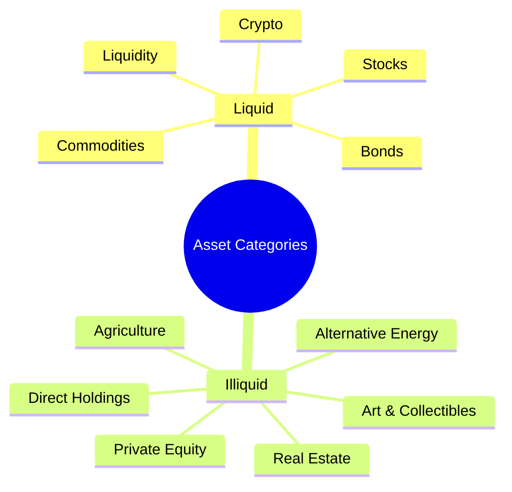
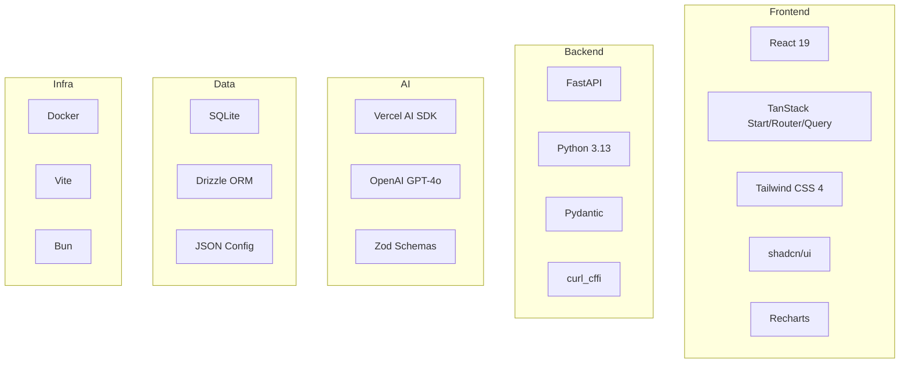

# System Architecture Diagrams

Visual diagrams of the Investment Dashboard system architecture using Mermaid syntax.

## High-Level Architecture



## Component Interaction

```mermaid
graph LR
    subgraph Dashboard["Dashboard UI"]
        Chart[Portfolio Chart]
        GovPanel[Gov Impact Panel]
        ChatUI[Chat Interface]
    end

    subgraph APIs["API Layer"]
        GovAPI[/api/gov-impact]
        ChatAPI[/api/chat]
        MarketAPI[/api/market-events]
    end

    subgraph Services["Services"]
        XService[X API Service]
        TSService[Truth Social Service]
        AIService[AI Analysis]
    end

    Chart --> GovAPI
    GovPanel --> GovAPI
    ChatUI --> ChatAPI

    GovAPI --> XService
    GovAPI --> TSService
    GovAPI --> AIService
    ChatAPI --> AIService
```

## Government Impact Analysis Flow



## Data Normalization Pipeline



## X API Query Strategy



## AI Tool Integration



## Database Schema



## Deployment Architecture



## Request/Response Flow



## 11 Asset Categories



## Technology Stack


